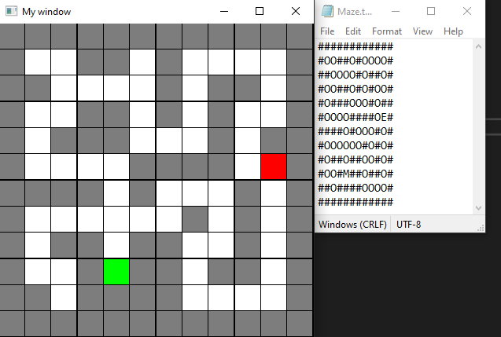

### Work in progress...

# ABOUT:

The purpose of this project is to create a visualizer for the A* algorithm which will find the optimal path inside of a maze.

The project will create a maze based off of what was inputted into the maze.txt file and visualize it.

