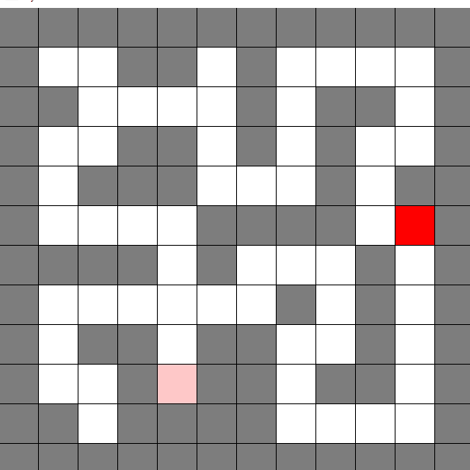

# A* Algorithm Visualizer

# What is the A* algorithm?

#### A* is an algorithm used to find the shortest path between two points.
#### While exploring a map, each node keeps track of a G and H value.
#### G holds a value of how far a node is from the starting point.
#### H holds a value of how far it would ideally be from the exit.
### Expanding from the node with the smallest G + H value, which the algorithm believes is closest to the exit, the algorithm will continue searching for the exit.

# ABOUT:

The purpose of this project is to create and visualize the paths that the A* algorithm takes to find the exit.

The project will create a maze based off of what was inputted into the maze.txt file and visualize it.

## Here is what each symbol represents in the txt file

### SPACE: O (Can traverse across)
### WALL: # (Cannot traverse across)
### MOUSE: M (Where the maze starts)
### END: E (Where the maze ends)
